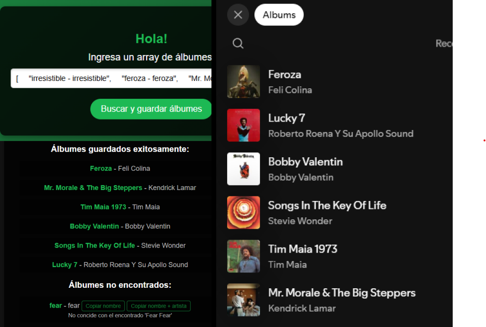

# Save Albums

App to save albums to your personal Spotify library. This project is designed for individual use and makes it easy to automate adding albums to your Spotify library.

> At the moment support for rym charts and lists & [600latam](https://www.600discoslatam.com/) & by terminal (cli).

> See the [guides for each one](#5--go-to-the-guide-you-want).

## 

## 📦 Installation

### 1. **Create an app on Spotify Dashboard**

Go to the [Spotify Developer Dashboard](https://developer.spotify.com/dashboard/) and create a new app to obtain your **Client ID** and **Client Secret**.

### 2. **Get a refresh token**

Follow the [Spotify official example](https://github.com/spotify/web-api-examples) to generate a refresh token that doesn’t expire:

- Navigate to the `/authorization/authorization_code` folder in the example.
- Complete the flow to get a token and save it for use in this project.

### 3. **Set up environment variables**

Create a `.env` file in the project root directory with the following content:

```env
CLIENT_ID=your_client_id
CLIENT_SECRET=your_client_secret
REFRESH_TOKEN=your_refresh_token
REDIRECT_URI=http://localhost:8888/callback
```

### 4. **Run project**

```bash
git clone https://github.com/brandonporcel/spotify-save-album.git
cd spotify-save-album
npm install
```

## 5. 📚 **Go to the guide you want**

- [600latam](src/guides/600-latam/readme.md)
- [rym chart](src/guides/rym/chart/readme.md)
- [rym playlist](src/guides/rym/playlist/readme.md)
- [terminal](src/guides/terminal/readme.md)

## 📋 TODO List

- [x] UI (User Interface): Add an input field and a button for easier album entry.
- [x] For 600latam: add another script for only get albums on playlist or albums who are only on youtube
- [ ] GitHub Action: Fix the action to upload a .txt file with unsaved albums.
- [ ] Add multi-language support for prompts (EN)
- [ ] Add IA feature to determine if found album its same than the search one

#### 🛠️ Technologies Used

- Node js
- Spotify Web API SDK

## 📝 Contributing

Open! Make a pr

## 📝 Feedback

I’d love to hear your thoughts! Contact me via [mail](mailto:brandon7.7porcel@gmail.com) or [linkedin](https://www.linkedin.com/in/brandonporcel/)
