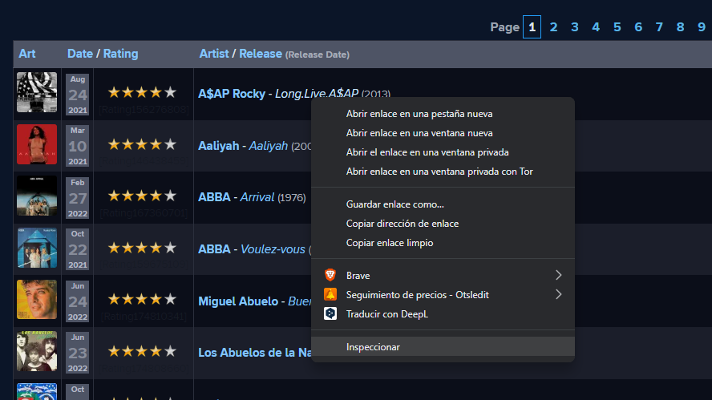

# RYM GUIDE

#### \_

[rym list](https://rateyourmusic.com/collection/AgustinWicki/r4.0)



```js
const items = document.querySelectorAll(".or_q_albumartist_td");
```


```js
const titles = new Array(...items).map((el) => el.innerText);
titles
// ["A$AP Rocky - Long.Live.A$AP (2013)","Aaliyah - Aaliyah (2001)", ...]
```

```js
titles.slice(1,11)
```

- put that in albums at `index.ts`

- `npm i` && `npm run dev` && enjoy life
