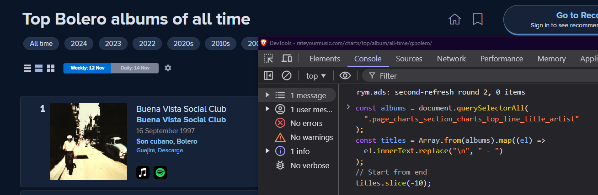

# RYM Guide for Chart

This guide is to explain how to get single albums from a Rate Your Music platform chart. By following these steps, you will be able to build an array of albums by inspecting elements of the RYM page.

## First steps

1. **Open RYM**: Go to the [some chart page in RYM](https://rateyourmusic.com/charts/top/album/all-time/g:bolero/) or another page of your choice that displays a list of albums.

2. **Inspect the elements**: Open the developer tools in your browser (usually by pressing `F12` or `Ctrl + Shift + I` in Chrome).

3. **Select albums**:

   - Search the container for the album titles using the appropriate selector. In this case, you can use `document.querySelectorAll(".page_charts_section_charts_charts_top_line_title_artist")`.
   - This selector will extract the elements corresponding to album and artist titles.

4. **Add albums to the array**:

   - In the developer tools console, you can run the following code to get the album names in a proper format:

     ```javascript
     const albums = Array.from(
       document.querySelectorAll(
         ".page_charts_section_charts_top_line_title_artist"
       )
     ).map((el) => el.innerText.replace("\n", " - "));
     ```

   - This code will create an array with the album titles in the format "Artist - Album".

5. **Paste in the code**:

   - Copy the resulting array and paste it into the `index.ts` file in the `albums` variable, so it looks like this:

     ```typescript
     const albums = [
       "Artist1 - Álbum1",
       "Artist2 - Álbum2",
       ...
     ];
     ```

## Code example

```javascript
const albums = document.querySelectorAll(
  ".page_charts_section_charts_top_line_title_artist"
);
const titles = Array.from(albums).map((el) =>
  el.innerText.replace("\n", " - ")
);
// Extrae los últimos 10 títulos del array
titles.slice(-10);
```
[cta edit](https://github.com/brandonporcel/spotify-save-album/edit/main/src/script.ts)


